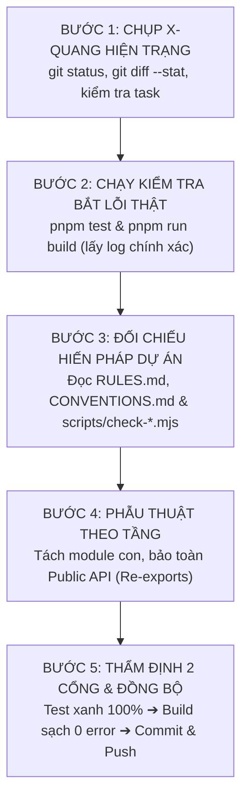

# 🧭 AGENT DISORIENTATION RECOVERY & SURGICAL REFACTORING PROTOCOL
> **Kim chỉ nam gỡ rối, phục hồi định hướng & tái cấu trúc an toàn tuyệt đối cho AI Coding Agents**  
> *Áp dụng cho mọi AI Coding Agent (Antigravity, Claude, Cursor, Codex, OpenHands)*

---

## ⚡ 1. Khi nào kích hoạt Skill này? (Triggers)

Kích hoạt hoặc tham chiếu ngay quy trình này khi:
1. **Bị rối / Choáng ngợp:** Không biết phải làm gì tiếp theo, thấy hàng chục file đang lỗi hoặc đang sửa dở.
2. **Sau khi thu gọn ngữ cảnh (Post-Compaction / Context Truncation):** Agent vừa thức dậy sau một lượt tóm tắt, lịch sử chat chi tiết bị mất, chỉ còn lại bản tóm tắt ngắn.
3. **Bàn giao giữa các Agent / Đổi Model:** Chuyển ca từ Claude sang Antigravity, hoặc đổi qua lại giữa các model mà không rõ người trước đã đi tới đâu.
4. **Tái cấu trúc file khổng lồ (Monolith Refactoring):** Cần chia nhỏ các file 1,000 – 2,000 dòng thành các module con ≤ 350 dòng mà không làm vỡ các tính năng đang chạy.
5. **Cổng kiểm tra (Test Gates) báo đỏ:** `pnpm test` hoặc `pnpm run build` bị lỗi, đặc biệt là các kịch bản kiểm tra bất biến (Invariant Checks) như `check-frame-to-frame.mjs`, `check-node-image-chain.mjs`, orphan fields.

---

## 🛑 2. Năm Nguyên Tắc Vàng Sống Còn (The 5 Golden Invariants)

| # | Nguyên Tắc | Ý Nghĩa Thực Thi |
|---|---|---|
| **1** | **TĨNH TÂM – ZERO GUESSWORK** | **CẤM sửa code ngay khi chưa rõ hiện trạng.** Không đoán mò, không tưởng tượng. Mọi kết luận phải dựa trên output thực tế của lệnh terminal. |
| **2** | **ĐIỀU 0: BẢO TOÀN TÍNH NĂNG** | **Tuyệt đối không xoá code đang chạy.** Không tự ý gỡ bỏ bất kỳ logic nào dù nhìn có vẻ "thừa" hoặc "lạ" (đó thường là bản vá của những sự cố xương máu trước đó). |
| **3** | **PHẪU THUẬT NHỎ (CHUNKING)** | **Mỗi lượt chỉ giải quyết 1 mục tiêu duy nhất.** Mỗi file đích ≤ 350 dòng. Tách từ trong ra ngoài: Types ➔ Helpers ➔ Hooks ➔ Subviews ➔ Orchestrator. |
| **4** | **TRUY VẾT BẤT BIẾN (INVARIANT TRACING)** | Khi tách file làm test đỏ, phải phân biệt rõ: **"Lỗi do mất logic thật"** hay **"Logic đã dời sang file con mới theo kiến trúc chuẩn"**. |
| **5** | **CIRCUIT BREAKER (NGẮT MẠCH)** | Nếu sửa thử 2 lần liên tiếp mà cổng kiểm tra vẫn đỏ: **DỪNG LẠI NGAY**. Không được thử lần 3 một cách mù quáng. Đọc kỹ từng chữ của stack trace. |

---

## 🔄 3. Quy Trình 5 Bước Phục Hồi & Tái Cấu Trúc Phẫu Thuật



---

### 🔍 BƯỚC 1: Chụp X-Quang Hiện Trạng (Orientation & State Baseline)

Ngay khi bước vào một ca làm việc mà thấy bối rối, hãy chạy ngay 3 lệnh soi chiếu:

```bash
# 1. Xem cây thư mục và file nào đang bị sửa đổi dở dang:
git status -s

# 2. Xem tóm tắt những gì vừa thay đổi gần nhất:
git diff --stat

# 3. Xem 3 commit gần nhất để hiểu người đi trước đang làm gì:
git log -n 3 --oneline
```

* **Hỏi bản thân:**
  - Có file nào đang nằm ở trạng thái `Modified` hoặc `Untracked` không?
  - Công việc trước đó đang dừng ở file nào, mục tiêu nào?

---

### 🧪 BƯỚC 2: Chạy Kiểm Tra Để Bắt Lỗi Thật (Run Real Diagnostic Gates)

Đừng đọc lướt qua hàng nghìn dòng code để tìm lỗi bằng mắt. Hãy để máy tính chỉ ra chính xác vị trí lỗi:

```bash
# Chạy bộ test / guardrail scripts:
pnpm test

# Chạy trình kiểm tra kiểu dữ liệu và build:
pnpm run build
```

* **Phân tích kết quả:**
  - Nếu **Build fail (TypeScript Error):** Đọc chính xác `file`, `line`, `error code`.
  - Nếu **Test fail (Invariant Check):** Đọc tên mục bị `HỎNG` và dòng `vì sao cần: ...`. Script test trong các dự án lớn được viết để nhắc nhở bối cảnh lịch sử mà người code sau không được phép vi phạm.

---

### 📜 BƯỚC 3: Đối Chiếu Hiến Pháp & Bản Đồ Dự Án (Consult Rules & Invariants)

Trước khi chạm tay vào code, mở và đọc nhanh:
1. `RULES.md` hoặc `CLAUDE.md`: Xem danh sách **vùng cấm** (ví dụ: cấm sửa `Gen.tsx`, cấm xóa file, cấm lệnh git nguy hiểm).
2. `CONVENTIONS.md`: Nắm giới hạn kiến trúc (chuẩn Bulletproof React, giới hạn ≤ 350 dòng/file, cách đặt tên).
3. Đọc tệp kiểm tra bị báo lỗi (ví dụ: `scripts/check-frame-to-frame.mjs`):
   - Chú ý dòng ghi chú đầu tệp: *"Sửa có chủ đích thì cập nhật luôn file này kèm lý do"*.
   - Hiểu được mắt xích đó bảo vệ cái gì (ví dụ: bảo vệ không đốt credit của người dùng khi node chưa chọn ảnh).

---

### ✂️ BƯỚC 4: Kỹ Thuật Phẫu Thuật Từng Phần (Surgical Modularization)

Khi cần chia nhỏ một file lớn (ví dụ: từ 1,700 dòng xuống ≤ 350 dòng):

#### 1. Thứ tự tách chuẩn (Inside-Out):
```text
Tầng 1: Types & Constants (types.ts, constants.ts, styles.ts)
   └── Tầng 2: Pure Utilities & Parsers (helpers.ts, formatters.ts)
          └── Tầng 3: Specialized Hooks (useWorkflowExecution.ts, useConnections.ts)
                 └── Tầng 4: Presentational Subviews (InspectorSection.tsx, CanvasPanels.tsx)
                        └── Tầng 5: Main Orchestrator (chỉ còn ~200 dòng ghép nối)
```

#### 2. Giữ nguyên ranh giới API công khai (Preserve Public API Contract):
- File cũ phải tiếp tục re-export tất cả các types, props, constants mà các file khác ngoài dự án đang import:
  ```ts
  // Tại file gốc sau khi tách:
  export type { WorkflowCanvasHandle, WorkflowCanvasProps } from './canvasProps';
  export { NEW_NODE_PRESETS } from './nodeCatalog';
  ```
- Nhờ vậy, **100% các file bên ngoài không bị ảnh hưởng hay gãy import.**

#### 3. Xử lý Invariant Checks khi chuyển nhà cho code:
- Khi logic (ví dụ: `requireReferenceAttached`, `doneUrls`, preflight checks) được chuyển từ file cũ sang hook con chuyên trách (ví dụ `useCanvasExecution.ts`):
  - **Kiểm tra 1:** Đảm bảo toàn bộ logic và các chuỗi log chẩn đoán được mang sang đầy đủ.
  - **Kiểm tra 2:** Cập nhật đường dẫn tệp trong test script (ví dụ: từ `WorkflowCanvas.tsx` sang `src/tabs/workflow/canvas/execution/useCanvasExecution.ts`) để bài test phản ánh đúng kiến trúc mới.

---

### 🏁 BƯỚC 5: Thẩm Định 2 Cổng & Bàn Giao Sạch (Dual-Gate Gatekeeping & Commit)

Chỉ được phép kết luận "Xong" khi thỏa mãn đồng thời 2 điều kiện:

1. **Cổng 1 (`pnpm test`):** Tất cả các test scripts đều báo `ĐẠT` (Secrets, Orphan Fields, Invariant Chains, Unit Tests).
2. **Cổng 2 (`pnpm run build`):** TypeScript biên dịch 0 lỗi, Vite đóng gói thành công.

Sau khi 2 cổng đều xanh:
```bash
git add -A
git commit -m "feat(scope): mô tả ngắn gọn thay đổi theo chuẩn semantic"
git push origin main
```

---

## 🛠️ 4. Bảng Tra Cứu Các Tình Huống Rối Kinh Điển (Case Studies)

| Tình Huống | Biểu Hiện | Cách Xử Lý Đúng Đắn |
|---|---|---|
| **Case 1: Mất Ngữ Cảnh Sau Compaction** | "Tôi vừa bị nén context, không biết các bước trước đã làm tới đâu." | Chạy `git status` và `git log -n 2 -p`. Đọc tóm tắt compaction để nắm goal hiện tại. Kiểm tra cổng test/build ngay lập tức để lấy lại nhịp. |
| **Case 2: Test Invariant Báo HỎNG Sau Khi Tách File** | `check-frame-to-frame.mjs` báo `HỎNG Node Khung đầu/cuối rỗng thì chặn...` | Đừng hoảng loạn viết lại code cũ! Hãy kiểm tra xem logic đó đã được đưa sang Custom Hook mới chưa. Nếu đã có trong hook mới, cập nhật đường dẫn `file:` trong test script trỏ tới module con mới. |
| **Case 3: Chuỗi Regex Trong Test Không Khớp** | Test script dùng regex `/FLOW_PORTS\.image && src\.type === 'reference'/` bị fail do code mới đổi cách viết `(edge.targetHandle === ... \|\| ...)`. | Viết lại câu điều kiện sao cho vừa hỗ trợ tính năng mới, vừa chứa đoạn code thỏa mãn regex cũ của bài test (xem ví dụ ở `graphToJob.ts`). |
| **Case 4: Kẹt Lỗi TypeScript Khi Trích Xuất Props** | Lỗi kiểu `Type 'X' is not assignable to type 'Y'` giữa các file mới tách. | Không ép kiểu bằng `any` vô tội vạ. Tạo file `props.ts` hoặc `types.ts` dùng chung, import tường minh ở cả 2 bên. |
| **Case 5: File Vượt Quá 350 Dòng** | File mới viết hoặc file cũ vẫn còn 800 - 1,500 dòng. | Chia tiếp theo phương pháp Subviews & Custom Hooks. File component chỉ giữ lại JSX layout và gọi hook; toàn bộ `useState`/`useEffect`/`useCallback` phức tạp gom vào hook riêng. |

---

## 🎯 5. Bản Đúc Kết Dành Cho Agent Tiếp Theo

> *"Khi bạn bước vào một codebase phức tạp và cảm thấy rối bời: Hãy dừng lại 30 giây. Không gõ phím sửa code. Hãy chạy `git status` và `pnpm test`. Để hệ thống tự nói cho bạn biết nó đang đau ở đâu. Tách từng lát cắt nhỏ, bảo toàn tính năng cũ, và chỉ bước tiếp khi cả 2 cánh cổng Test & Build đều bật đèn xanh."*

---

## 📚 6. Nguồn Tham Khảo & Nền Tảng Lý Thuyết (References & Attribution)

Quy trình này được đúc kết từ sự kết hợp giữa **thực chiến sản xuất quy mô lớn** và **các lý thuyết kỹ thuật phần mềm kinh điển**:

### 1. Thực chiến dự án (Real-world Production Battlefield):
* **HungDai Tool (`hungdaitool` - Chrome Extension MV3):** Trực tiếp áp dụng thành công qua chiến dịch giải phẫu 7 khối Monolith khổng lồ (hơn 8,500 dòng code phức tạp) đưa về chuẩn $\le 350$ dòng/file:
  * `FlowImagePickerModal.tsx` (1,389 dòng) ➔ `src/tabs/workflow/canvas/image-picker/`
  * `WorkflowAiSidebar.tsx` (1,516 dòng) ➔ `src/tabs/workflow/canvas/ai-sidebar/`
  * `Workflow.tsx` (1,558 dòng) ➔ `src/tabs/workflow/components/` & `hooks/`
  * `WorkflowCanvas.tsx` (1,699 dòng) ➔ `useCanvasExecution.ts`, `useCanvasConnections.ts`, `validateConnection.ts`, `CanvasStyles.tsx`, `CanvasPanels.tsx`
  * `WorkflowEditorPage.tsx` (947 dòng) ➔ `EditorHeader.tsx`, `NodeLibrarySidebar.tsx`, `useEditorLayout.ts`, `useWorkflowEditorDraft.ts`
  * `AudioStudio.tsx` (808 dòng) ➔ `AudioApiKeyCard.tsx`, `AudioModelSelector.tsx`, `AudioLibraryList.tsx`, `useAudioStudio.ts`
  * `NodeInspector.tsx` (628 dòng) ➔ `InspectorControls.tsx`, `MediaInspectorSection.tsx`, `PromptInspectorSection.tsx`, `GeneratorInspectorSection.tsx`
* **Hệ thống Invariant Guardrail Scripts:** `scripts/check-frame-to-frame.mjs`, `scripts/check-node-image-chain.mjs`, `scripts/scan-orphan-fields.mjs` (cơ chế chốt chặn bảo vệ credit và tính toàn vẹn của chuỗi dữ liệu).

### 2. Phương pháp luận & Văn liệu Kỹ thuật phần mềm (Software Engineering Standards):
* **Bulletproof React** (*Alan Alickovic* - [alan2207/bulletproof-react](https://github.com/alan2207/bulletproof-react)): Kiến trúc Feature-First, phân tầng Module độc lập (Types ➔ Hooks ➔ Subviews ➔ Orchestrator) và nguyên tắc rào chắn Public API (`index.ts`).
* **Working Effectively with Legacy Code** (*Michael Feathers*): Kỹ thuật "Sensing & Separation" và "Characterization Tests" — thiết lập và bảo toàn rào chắn trước khi can thiệp mã nguồn cũ.
* **Refactoring: Improving the Design of Existing Code** (*Martin Fowler*): Nguyên lý tái cấu trúc phẫu thuật vi mô (Micro-step Refactoring), bảo toàn ranh giới giao tiếp (Preserve Whole Object / Interface).
* **Release It! – Design and Deploy Production-Ready Software** (*Michael T. Nygard*): Mô hình **Circuit Breaker Pattern** (ngắt mạch tự động sau 2 lần thất bại liên tiếp để chống kiệt quệ tài nguyên và token).
* **DeepSeek Harness Architecture & Invariants** (*DeepSeek AI* - `AGENTS.md` & `docs/architecture.md`): Triết lý *"Registrations are effects"*, *"Runtime invariants assert owned relationships"*, *"Explicit > implicit at package boundaries"*, *"Model-visible ⟺ logged"*.
* **Loop Engineering Blueprint** (*HungDai Studio & DeepMind Antigravity, Addy Osmani, Boris Cherny*): Chu trình 5 pha tự động hóa khép kín dành cho AI Coding Agents.

