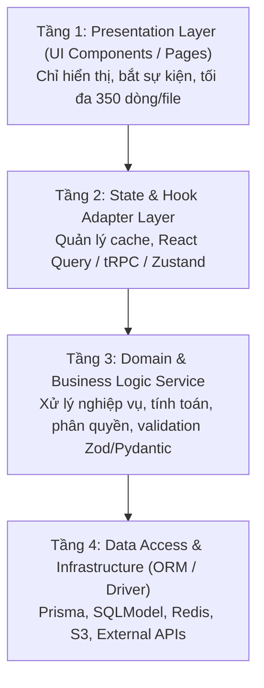

# 🚀 FULLSTACK BOILERPLATE ARCHITECT

> **Mục tiêu:** Giúp AI Coding Agent tự chủ lựa chọn và dựng khung dự án Full-Stack (Frontend, Backend, Database) hoàn chỉnh, chuẩn chỉ, có sẵn cơ chế an toàn (Guardrails), phân tầng nghiêm ngặt (Strict 4 Layers) và không bao giờ phá vỡ mã nguồn đang chạy (Tuân thủ Điều 0).

---

## 🧭 1. Ma Trận Lựa Chọn Boilerplate (Decision Matrix)

Trước khi chạy bất kỳ lệnh tạo app nào, AI Agent phải đối chiếu yêu cầu của người dùng với bảng tiêu chí sau:

| Trường hợp sử dụng | Boilerplate đề xuất | Công nghệ chính | Lý do ưu tiên |
| :--- | :--- | :--- | :--- |
| **Ứng dụng SaaS, Web App, Tốc độ cao** | **T3 Stack** | Next.js (App Router) + tRPC + Prisma + PostgreSQL | End-to-end type safety, không cần viết API client thủ công, DX tốt nhất cho TypeScript. |
| **AI Backend, Xử lý dữ liệu, Python nặng** | **FastAPI + SQLModel + React** | FastAPI + SQLModel + React (Vite) + Docker Compose | Tận dụng hệ sinh thái Python (AI, ML, Celery, FFmpeg), SQLModel kết hợp Pydantic & SQLAlchemy cực gọn. |
| **Ứng dụng Copilot / Chat AI / Vector Search** | **AI-First Agent Stack** | Next.js + Vercel AI SDK + pgvector + DeepSeek API | Streaming text native, hỗ trợ function calling, semantic search tích hợp sẵn vào Postgres. |
| **Microservices / Độc lập hoàn toàn** | **Clean Layered Architecture** | NestJS / Express backend riêng biệt, Next.js frontend | Phù hợp khi team backend và frontend phát triển độc lập, yêu cầu DDD (Domain-Driven Design). |

---

## ⚙️ 2. Quy Trình Khởi Tạo Chuẩn (Scaffolding Protocol)

### 2.1. Quy tắc an toàn (Điều 0 & Package Manager Invariant)
1. **Kiểm tra công cụ quản lý gói hiện có:**
   - Nếu trong thư mục đã có `pnpm-lock.yaml` ➔ **BẮT BUỘC** dùng `pnpm`.
   - Nếu có `yarn.lock` ➔ dùng `yarn`.
   - Chỉ dùng `npm` khi có `package-lock.json` hoặc dự án chưa có gì.
2. **Luôn chạy lệnh ở chế độ Non-Interactive (Không chặn terminal chờ prompt):**
   - Không chạy lệnh khiến terminal bị treo hỏi câu hỏi trắc nghiệm (như `npm init` thô).
   - Truyền đầy đủ cờ `--CI`, `--yes`, `-y`, hoặc tham số tương ứng.

### 2.2. Lệnh khởi tạo tiêu chuẩn cho từng Stack

#### Lựa chọn A: T3 Stack
```bash
pnpm create t3-app@latest ./ \
  --tailwind \
  --trpc \
  --prisma \
  --nextAuth \
  --appRouter \
  --CI \
  --noGit
```

#### Lựa chọn B: FastAPI + SQLModel Monorepo
```bash
# Khởi tạo thư mục backend và frontend
mkdir -p backend/app frontend
# Backend Python
cd backend
python -m venv .venv
# Kích hoạt venv (Windows: .venv\Scripts\activate, Linux/macOS: source .venv/bin/activate)
pip install fastapi "uvicorn[standard]" sqlmodel asyncpg psycopg2-binary alembic pydantic-settings
# Frontend Vite
cd ../frontend
pnpm create vite@latest ./ --template react-ts
pnpm add @tanstack/react-query axios lucide-react
```

---

## 🏛️ 3. Phân Tầng Kiến Trúc 4 Lớp Bắt Buộc (4-Tier Separation)

Để tránh tình trạng code biến thành "mì spaghetti" và giúp các AI Agent sau này dễ debug, toàn bộ dự án phải tuân thủ nghiêm ngặt 4 lớp:



### Các điều cấm trong phân tầng:
1. **CẤM** viết câu truy vấn SQL hoặc gọi trực tiếp ORM (`prisma.*`, `db.session.*`) bên trong Component UI.
2. **CẤM** đặt logic tính toán tiền bạc, phân quyền hoặc mật khẩu ở Frontend.
3. **CẤM** file vượt quá **350 dòng**. Khi file chạm mốc 300 dòng, lập tức bóc tách sub-components hoặc sub-services.

---

## 🛡️ 4. Thiết Lập Cổng Kiểm Tra Tự Động (Verification Gates)

Ngay sau khi scaffold xong, Agent phải kiểm tra và bổ sung các script sau vào `package.json`:

```json
{
  "scripts": {
    "typecheck": "tsc --noEmit",
    "lint": "eslint . --ext .ts,.tsx",
    "budget:check": "node -e \"const fs = require('fs'); const glob = require('glob'); /* check files <= 350 lines */\"",
    "verify": "pnpm run typecheck && pnpm run lint && pnpm run test"
  }
}
```

### Tích hợp GitHub Actions Quality Gate:
Copy file `templates/github-ci.template.yml` vào `.github/workflows/ci.yml` của dự án để đảm bảo mọi Pull Request đều được kiểm tra:
1. TypeScript Typecheck 100% pass.
2. Không có file mã nguồn nào vượt quá 350 dòng.
3. Quét rò rỉ Secret / API key.
4. Pass toàn bộ Unit Test.

---

## 🔄 5. Gắn Kết Với Vòng Lặp Loop Engineering

1. **Khởi tạo trạng thái:** Dùng lệnh `node scripts/task-status.js start INIT "Scaffold Fullstack Boilerplate"` để cập nhật `TASK_STATUS.json`.
2. **Ghi nhận quyết định kiến trúc:** Cập nhật ngay vào `docs/ARCHITECTURAL_DECISIONS.md`:
   - Tại sao chọn Stack này?
   - Cấu trúc Database gồm những Entity nào?
   - Cơ chế Authentication (Session Cookie hay JWT Bearer)?
3. **Ghi nhật ký CHANGELOG:** Ghi nhận phiên bản khởi tạo `0.1.0` vào `CHANGELOG.md`.
4. **Nghiệm thu cổng:** Chạy lệnh `pnpm run verify` (hoặc tương đương). Chỉ khi exit code là 0 thì mới cập nhật trạng thái `READY_FOR_REVIEW`.
