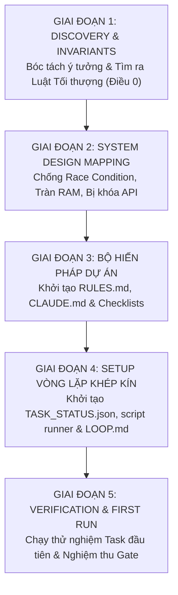

# 🏛️ PROJECT BLUEPRINT & LOOP ARCHITECT (FROM IDEA TO AUTONOMOUS LOOP)

> **Mục tiêu tối thượng:** Biến một ý tưởng thô (Raw Idea) thành một **Bản thiết kế kiến trúc chuẩn mực (Architectural Blueprint)** và một **Vòng lặp tự động hóa khép kín (Loop Engineering)**.  
> **Ngăn chặn triệt để:** Dự án bị chệch hướng, AI sửa bừa làm vỡ mã nguồn, ảo giác "đã xong", mất trí nhớ ngữ cảnh (context drift) hoặc xung đột giữa các AI Agents.

---

## ⚡ 1. Điều kiện kích hoạt (Triggers)

Kích hoạt skill này bất cứ khi nào người dùng nói hoặc gõ:
- *"Tôi có một ý tưởng dự án mới, hãy giúp tôi lên blueprint / kiến trúc"*
- *"Tạo khung dự án chuẩn Loop Engineering / System Design"*
- *"Làm sao để setup cho Claude và Antigravity phối hợp làm dự án này không bị vỡ?"*
- `setup loop engineering` / `create project blueprint` / `khởi tạo dự án chuẩn`
- Khi bắt đầu một thư mục dự án mới tinh hoặc muốn tái cấu trúc một dự án đang lộn xộn.

---

## 🧭 2. Quy trình 5 Giai đoạn chuẩn từ Ý tưởng đến Blueprint hoàn chỉnh



---

### 🟢 GIAI ĐOẠN 1: Discovery & Core Invariant Extraction (Bóc tách ý tưởng & Ranh giới sống còn)

Trước khi viết bất kỳ file code nào, Agent phải phỏng vấn ngắn gọn hoặc tự phân tích 4 câu hỏi sống còn:

1. **Vấn đề cốt lõi (Core Problem):** 
   - Ứng dụng này giải quyết nỗi đau gì? Đối tượng người dùng là ai?
   - Nền tảng thực thi là gì? *(Web App, Chrome Extension MV3, Backend Service, CLI Tool, Mobile App?)*
2. **Nguồn sự thật duy nhất (Single Source of Truth):**
   - Dữ liệu sống ở đâu? *(LocalStorage, IndexedDB, Postgres, Cloud Firestore, File trên đĩa?)*
   - Khi có xung đột dữ liệu giữa Client và Server, bên nào có tiếng nói quyết định?
3. **ĐIỀU 0 — LUẬT TỐI THƯỢNG (Unbreakable Law):**
   - *Hành động nào nếu xảy ra sẽ phá hủy hoàn toàn dự án hoặc gây hậu quả nghiêm trọng cho người dùng?*
   - *Ví dụ mẫu:*
     - Chrome Extension: **CẤM MỌI LỆNH XOÁ FILE.** Cấm tự ý click nút xoá trên trang thật.
     - Tài chính/Crypto: **CẤM LƯU HOẶC LOG PRIVATE KEY / TOKEN DƯỚI DẠNG PLAIN TEXT.**
     - Automation tool: **CẤM SPAM REQUEST VƯỢT QUOTA LÀM KHOÁ TÀI KHOẢN NGƯỜI DÙNG.**
4. **Phân vùng Ranh giới (Boundary Partitioning):**
   - **Vùng Lõi (Core / Critical Path):** Tính năng xương sống, ổn định, chạy sản xuất (ví dụ: Auth, Payment, Engine tạo media). Agent bình thường **KHÔNG ĐƯỢC PHÉP CHẠM VÀO**.
   - **Vùng Ngoại vi (Peripheral / Experimental):** Giao diện mới, tính năng phụ trợ, UI Polish. Cho phép thử nghiệm và mở rộng tự do.

---

### 🟡 GIAI ĐOẠN 2: System Design Mapping (Ánh xạ chuẩn kiến trúc hệ thống)

Dựa trên triết lý **System Design Primer**, thiết lập 5 nguyên lý kỹ thuật cho dự án:

1. **Concurrency & Locking:** Nếu người dùng bấm nhanh (double click) hoặc nhiều luồng async cùng ghi vào 1 biến/storage, điều gì xảy ra? *(Cần debounce, throttle hoặc async-mutex).*
2. **Idempotency (Lũy đẳng):** Nếu mạng chập chờn khiến 1 request gửi đi 2 lần, làm sao để hệ thống không tạo 2 đơn hàng / 2 job trùng lặp? *(Cần sinh unique `jobId` / `requestId` ngay từ lúc bấm).*
3. **Backpressure & Queue:** Nếu có 50 tác vụ cùng lúc, hệ thống có bị nghẽn RAM / Network không? *(Cần đặt trần Concurrency Limit, ví dụ: tối đa 3 tác vụ chạy đồng thời).*
4. **Resilience & Backoff:** Khi API bên thứ ba trả về mã lỗi 429 (Rate limit) hoặc 503 (Server sập), hệ thống có tự động giãn cách (Exponential Backoff) không?
5. **Resource Cleanup:** Các EventListener, Interval, DOM Node đã tách (Detached Nodes) có được giải phóng (dispose) khi tắt màn hình không?

---

### 🟠 GIAI ĐOẠN 3: Thiết lập Bộ Hiến Pháp Dự Án (The Constitution Blueprint)

Tạo ngay 3 file tài liệu nền tảng tại thư mục gốc của dự án:

#### 1. `RULES.md` — Quy chuẩn bất khả xâm phạm của dự án
* Định nghĩa **Điều 0** (Luật cấm cao nhất).
* Liệt kê danh sách các file/thư mục thuộc vùng cấm tuyệt đối (Blacklist paths).
* Quy tắc bảo toàn dữ liệu (Backward compatibility): Không xoá field cũ, chỉ cộng thêm field mới.

#### 2. `CLAUDE.md` — Sổ tay chỉ dẫn dành cho AI Lead / Tech Lead
* Tóm tắt dự án trong 3 câu.
* Bảng "Thứ tự đọc bắt buộc" trước khi code.
* 7 điều cấm kỵ không được làm.
* Lệnh chạy kiểm chứng (Verification Gate) bắt buộc trước khi báo hoàn thành.

#### 3. `docs/SYSTEM_DESIGN_AUDIT_CHECKLIST.md` — Kim chỉ nam tư duy
* 6 trụ cột System Design chuyển dịch sang nền tảng của dự án.
* Tuyên ngôn: **Kim chỉ nam tham chiếu (Compass), KHÔNG PHẢI chiếc lồng gò ép (Not a cage).**

---

### 🔵 GIAI ĐOẠN 4: Thiết lập Vòng Lặp Khép Kín (Closed Loop & State Setup)

Để các Agent (Claude, Antigravity...) tự động phối hợp mà không cần người dùng làm cầu nối trung chuyển thủ công:

#### 1. Tạo file Máy Trạng Thái: `TASK_STATUS.json`
```json
{
  "taskId": "TASK_INIT",
  "title": "Khởi tạo khung dự án và thiết lập vòng lặp",
  "status": "DONE",
  "currentAction": "Đã thiết lập đầy đủ Blueprint & Loop",
  "buildPassed": true,
  "blockedReason": null,
  "owner": "architect",
  "updatedAt": "2026-09-10T08:00:00.000Z"
}
```

*Các trạng thái hợp lệ (State Machine):*
* `IDLE`: Rảnh rỗi, chờ task mới.
* `ASSIGNED`: Đã giao cho một Agent cụ thể.
* `IN_PROGRESS`: Agent đang đọc đề và viết code.
* `READY_FOR_REVIEW`: Đã code xong, pass 100% Gates, sẵn sàng để Lead nghiệm thu.
* `BLOCKED`: Gặp bế tắc / kích hoạt Circuit Breaker, dừng lại chờ người gỡ rối.
* `DONE`: Task đã được duyệt và gộp vào nhánh chính.

#### 2. Tạo Script điều phối: `scripts/task-status.js`
Script Node.js đơn giản hỗ trợ các lệnh CLI:
- `node scripts/task-status.js show` (Xem task hiện tại)
- `node scripts/task-status.js start <id> <msg>` (Nhận việc)
- `node scripts/task-status.js ready <msg>` (Báo xong)
- `node scripts/task-status.js done <msg>` (Duyệt xong)
- `node scripts/task-status.js block <reason>` (Báo nghẽn)

#### 3. Tạo file `LOOP.md`
* Định nghĩa quy trình 5 bước: `Discover` ➔ `Scope Check` ➔ `Execute` ➔ `Quality Gates` ➔ `Hand-off`.
* **Quy định cổng kiểm chứng cứng (Hard Gates):**
  ```bash
  npm test && npm run typecheck && npm run build
  ```
* **Cơ chế Circuit Breaker:** Nếu sửa lỗi build quá 2 lần liên tiếp không qua cổng ➔ Dừng lại ngay lập tức, chuyển cờ sang `BLOCKED`, không đoán mò làm tốn token.

---

### 🟣 GIAI ĐOẠN 5: Verification & First Sprint Execution

1. Chạy thử nghiệm lệnh build/test kiểm tra hệ thống:
   ```bash
   npm run build
   ```
2. Thực hiện một nhiệm vụ nhỏ đầu tiên (L1 hoặc L2) để kiểm chứng xem:
   - File `TASK_STATUS.json` có cập nhật nhịp nhàng không?
   - Khi có lỗi, Circuit Breaker có ngắt kịp thời không?
   - Cổng build có chặn đứng được các lỗi cú pháp/kiểu không?
3. Khi mọi thứ trơn tru ➔ Hệ thống đã sẵn sàng để vận hành bền vững dài hạn!

---

## 📋 Checklist Kiểm Tra Nhanh (Audit Khi Hoàn Thành Blueprint)

Trước khi tuyên bố hoàn thành blueprint, kiểm tra xem dự án đã có đủ 5 "chốt chặn thép" này chưa:

- [ ] 1. Có **Điều 0 (Luật tối thượng)** bảo vệ an toàn dữ liệu/mã nguồn chưa?
- [ ] 2. Đã phân biệt rõ **Vùng Cốt Lõi (Core)** và **Vùng Cho Phép Sửa (Peripheral)** chưa?
- [ ] 3. Có **Cổng kiểm chứng chất lượng tự động (Test/Typecheck/Build)** chưa?
- [ ] 4. Có **File máy trạng thái bền vững trên đĩa (`TASK_STATUS.json`)** chưa?
- [ ] 5. Có **Cơ chế ngắt mạch (Circuit Breaker)** chặn bot lặp vô tận và đốt token chưa?

> 🚀 **Ghi nhớ:** *Một kiến trúc tốt không phải là viết thật nhiều code ngay từ đầu, mà là đặt ra những đường ray chuẩn để bất kỳ ai (hay bất kỳ con bot nào) khi nhảy vào cũng chỉ có thể đi đúng hướng.*
