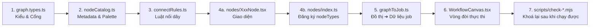

# 🎛️ WORKFLOW NODE STUDIO — Thiết kế & Lập trình Custom Node trên Canvas

> Đúc kết từ **HungDaiTool** (Chrome MV3 + React + `@xyflow/react`), sau nhiều
> tháng dựng Workflow Studio và một ngày sửa liên tục 6 lượt mới cho một chuỗi
> node chạy đúng.
>
> **Mọi con số, mã màu và tên hàm trong tài liệu này đều lấy từ mã nguồn thật.**
> Chỗ nào là khuyến nghị chứ chưa kiểm chứng, sẽ ghi rõ.

---

## ⚡ 1. Điều kiện kích hoạt (Triggers)

- *"Thêm cho tôi một node mới trên canvas"* / *"tạo node Ghép Video / Upscale / Lồng tiếng"*
- *"Dựng giao diện studio kiểu Picsart Flow / ComfyUI"*
- *"Nối node A sang node B mà dữ liệu không chạy"*
- *"Node hiện sai kết quả / hiện kết quả của lượt trước"*
- *"Nút trên node bấm không ăn"*
- Khi cần biên dịch đồ thị (graph) thành danh sách job thực thi tuần tự.

---

## 🧭 2. Bản đồ kiến trúc — 7 điểm chạm khi thêm MỘT node



**Quên bất kỳ điểm nào cũng KHÔNG gây lỗi biên dịch** — đó là đặc tính nguy hiểm
nhất của kiến trúc node. Mỗi mục dưới đây ghi rõ *quên thì hỏng như thế nào*.

---

# 🎨 TRỤ CỘT 1 — Design System của Studio

## 1.1 Bảng nền: ba tầng độ sâu, không phải một màu

| Vai trò | Mã màu thật | Dùng ở đâu |
| :--- | :--- | :--- |
| Panel nổi / glass | `bg-[#14151a]/95…/98` + `backdrop-blur-xl` | `NodePalette`, `FloatingPromptBar`, modal |
| Thân node | `bg-[#16171b]` | `NodeShell` |
| Ô nhập lõm | `bg-[#0e0f14]` | input, ô thư mục |

Viền luôn là **trắng rất mờ**, không dùng màu xám đặc:
`border-white/[0.06]` (đường chia trong node) → `border-white/[0.09]` (viền node)
→ `border-white/10…/12` (panel nổi) → `border-white/45` (node đang chọn).

> ⚠️ Yêu cầu ban đầu có nhắc tone `#0a0b0e`. **Mã này không tồn tại trong mã
> nguồn HungDaiTool** — nền canvas do React Flow (`colorMode="dark"`) vẽ. Đừng
> chép một token màu chưa kiểm chứng vào dự án mới.

## 1.2 Màu nhấn = ngôn ngữ phân loại, không phải trang trí

Bảng `ACCENT` trong `nodes/shared.tsx` là **tín hiệu phân loại node duy nhất**
trên canvas — chấm nhỏ ở header và màu cổng cắm:

```ts
export const ACCENT: Record<ComfyNodeKind, { dot: string }> = {
  reference: { dot: '#c084fc' },  // tím  — ảnh tham chiếu
  character: { dot: '#f472b6' },  // hồng — nhân vật
  frames:    { dot: '#60a5fa' },  // xanh dương — khung đầu/cuối
  prompt:    { dot: '#fb923c' },  // CAM  — xem ghi chú bên dưới
  note:      { dot: '#78716c' },  // xám  — giấy nhớ, không tham gia luồng chạy
  flowImage: { dot: '#a3e635' },  // lime — node sinh media
  flowVideo: { dot: '#a3e635' },
  output:    { dot: '#22d3ee' },  // cyan — đầu ra
};
```

**Bài học đắt nhất về màu:** prompt từng dùng chung lime với node sinh media.
Hậu quả: trên node Tạo Ảnh, cổng *"Prompt"* và cổng ra trùng màu nhau — lúc kéo
dây không còn nhìn màu mà biết mình cắm đúng chỗ. Chọn cam vì trên vòng màu nó
cách xa **nhất** mọi màu đang dùng (tím 270°, hồng 330°, xanh dương 217°, lime
82°, cyan 187° — cam ~27°), nên khó lẫn kể cả khi nhìn lướt hoặc với người khó
phân biệt màu.

> **Nguyên tắc rút ra:** khi chọn màu cho một loại node mới, đừng hỏi *"màu nào
> đẹp"* mà hỏi *"màu nào ở xa nhất trên vòng màu so với những màu đã dùng"*.

Lime (`#a3e635`) còn giữ hai vai trò cố định: **hành động chạy** (nút ▶) và
**thanh Trợ lý AI**. Không dùng lime cho việc khác.

## 1.3 Thân node: trung tính, màu chỉ xuất hiện ở điểm nhỏ

Theo ngôn ngữ Picsart Flow. Trước đây màu phủ cả dải gradient header khiến canvas
nhiều node trông rực và ồn. Nay:

```tsx
// nodes/shared.tsx — NodeShell
className={`relative group/node flex flex-col rounded-[14px] bg-[#16171b] border
            transition-colors duration-150 ${
  selected
    ? 'border-white/45 shadow-[0_0_0_1px_rgba(255,255,255,0.12),0_18px_40px_-12px_rgba(0,0,0,0.9)]'
    : 'border-white/[0.09] hover:border-white/20 shadow-[0_14px_34px_-14px_rgba(0,0,0,0.85)]'
}`}
```

Node được chọn thì **viền sáng trắng**, không đổi sang màu loại — giữ canvas yên
tĩnh. `NODE_WIDTH = 232` là bề ngang chuẩn của mọi node không co giãn.

## 1.4 Micro-interaction: chỉ giữ thứ nói lên trạng thái

| Hiệu ứng | Nơi dùng | Nói lên điều gì |
| :--- | :--- | :--- |
| `NodeStatusIndicator variant="border"` | mọi node sinh media | đang chạy / xong / lỗi |
| Nút xoá hiện khi hover (`opacity-0 group-hover/node:opacity-100`) | header node | canvas lúc bình thường gọn |
| `InteractiveParticleRing` | `EmptyStatePicker` (canvas trống) | mời tương tác khi chưa có gì |
| Dây nhấp nháy `type: 'animated'` | **chỉ dây liên quan lượt chạy** | node nào đang chạy |

**Chi tiết dễ bỏ sót:** khi chạy riêng một node mà cho **cả canvas** nhấp nháy
thì không nhìn ra đang chạy cái gì. Chỉ animate dây có `source` hoặc `target`
nằm trong tập đang chạy.

Một cạm bẫy CSS thật: `NodeStatusIndicator` vẽ lớp gradient bằng
`position: absolute`. Node cha **bắt buộc** phải `relative`, nếu không gradient
bám vào viewport và loang ra ngoài node.

## 1.5 ⛔ Điều 6 — Không có nút bấm trang trí

> Mọi control trên UI phải truy vết được xuống một hành động có thật, nếu không
> thì xoá.

HungDaiTool đã dính **4 lần**: Âm thanh/Giọng đọc, node Khung đầu/cuối (đặt node,
chọn ảnh, nối dây — nhưng bộ dựng job không hề đọc), ô Số lượng (hardcode 1),
End Frame.

Kiểu hỏng này **im lặng tuyệt đối**: người dùng bấm, giao diện phản hồi, job vẫn
chạy — chỉ kết quả là sai. Không `typecheck` nào bắt được. Đó là lý do có bộ quét
field mồ côi ở Trụ cột 3.

---

# 🧱 TRỤ CỘT 2 — Cẩm nang 6 bước tạo Custom Node

Ví dụ xuyên suốt: thêm node **"Ghép Video"** (`videoMerge`) nhận nhiều clip.

## Bước 1 — Type System (`graph.types.ts`)

```ts
export type ComfyNodeKind =
  | 'prompt' | 'note' | 'reference' | 'character' | 'frames'
  | 'flowImage' | 'flowVideo' | 'output'
  | 'videoMerge'                      // ← THÊM VÀO ĐÂY
  /** @deprecated node gộp cũ; normalizeGraphNodes() tự đổi sang flowImage/flowVideo */
  | 'flow';

export const FLOW_PORTS = {
  image: 'image', motion: 'motion', character: 'character',
  frames: 'frames', prompt: 'prompt', out: 'out',
} as const;
```

### ⛔ Luật vàng: CHỈ ĐƯỢC CỘNG THÊM FIELD OPTIONAL

Đồ thị người dùng đã lưu trong `chrome.storage.local` (hoặc DB). Đổi tên, đổi
kiểu, hay xoá một field là **mọi đồ thị cũ vỡ trong im lặng** — không crash, chỉ
là node mở ra trống rỗng.

```ts
// ✅ ĐÚNG
mergeMode?: 'sequential' | 'crossfade';

// ❌ SAI — phá dữ liệu đã lưu
resultUrl: string[];        // đổi kiểu
renamedField?: string;      // đổi tên field cũ
```

Field đã chết cũng **không xoá**, mà khai vào danh sách "ngủ đông" kèm lý do
(xem Trụ cột 3).

### Mẹo thiết kế: đẩy trạng thái vào DÂY, đừng vào FIELD

Ví dụ thật: node Ghép Video cần biết **thứ tự** các clip. Hai cách:

| Cách | Thứ tự nằm ở đâu | Đánh giá |
| :--- | :--- | :--- |
| Một cổng + `clipOrder?: string[]` | field ẩn trong node | phải đồng bộ với dây; lệch nhau là hỏng |
| **Nhiều cổng đánh số** `clip1…clip6` | **chính cái dây người dùng cắm** | **không có trạng thái ẩn nào để lệch** |

Chọn cách 2 ⇒ **không cần thêm field nào**, không đụng dữ liệu đã lưu. Đây là
cách rẻ nhất để tuân thủ luật vàng: *không thêm field thì không thể phá field*.

## Bước 2 — Catalog & Palette (`nodeCatalog.ts`)

Catalog là **nguồn sự thật duy nhất** cho: palette tìm kiếm, nút "+", bảng gợi ý
khi thả dây ra vùng trống, empty state, thư viện cột trái.

```ts
export interface CatalogItem {
  title: string;            // tên đặt cho node khi vừa tạo
  label: string;            // nhãn trong palette
  hint: string;             // mô tả 1 dòng, cũng là từ khoá tìm kiếm phụ
  group: string;            // 'Nội dung' | 'Tạo' | 'Đầu ra'
  tabs?: NodeTabId[];       // BỎ TRỐNG = hiện ở MỌI tab
  icon: React.ElementType;  // Lucide
  badge?: string;
  fields: ComfyNodeFields;  // giá trị khởi tạo
  size?: { width: number; height: number };  // node co giãn được
}
```

**Ba quyết định đáng chép sang dự án khác:**

1. **`tabs?` bỏ trống = hiện ở MỌI tab.** Cố ý chọn mặc định "ồn ào" thay vì ẩn:
   quên khai thì thấy node nằm nhầm chỗ và sửa ngay; ẩn mất thì không ai phát
   hiện. Trước đây palette giữ một bảng `TAB_KINDS` liệt kê tay — thêm node mà
   quên cập nhật là node **biến mất khỏi mọi tab**, im lặng không báo gì.
2. **Thứ tự khai trong catalog = thứ tự người dùng nhìn thấy.** Sắp lại cho "gọn
   mắt" là đổi trải nghiệm.
3. **Chỉ liệt kê node CHẠY ĐƯỢC THẬT.** Picsart Flow có Upscale / Remove
   Background vì họ chạy model riêng; nền tảng đích không phơi chức năng đó thì
   không đưa vào — *mục bấm vào mà không chạy còn tệ hơn không có mục*.

## Bước 3 — Luật nối dây (`connectRules.ts`)

```ts
export const ACCEPTS: Partial<Record<ComfyNodeKind, Partial<Record<ComfyNodeKind, string[]>>>> = {
  flowImage: {
    reference: [FLOW_PORTS.image],
    character: [FLOW_PORTS.character],
    prompt:    [FLOW_PORTS.prompt],
    flowImage: [FLOW_PORTS.image],   // chuỗi Ảnh ➔ Ảnh
  },
  flowVideo: {
    reference: [FLOW_PORTS.image, FLOW_PORTS.motion],  // MỘT cặp, NHIỀU cổng
    frames:    [FLOW_PORTS.frames],
    flowImage: [FLOW_PORTS.image],   // Ảnh ➔ Video (kiểu Picsart)
  },
  videoMerge: { flowVideo: ['clip1', 'clip2', 'clip3', 'clip4', 'clip5', 'clip6'] },
};
```

**⚠️ THỨ TỰ KHAI Ở ĐÂY LÀ THỨ TỰ GỢI Ý KHI THẢ DÂY RA VÙNG TRỐNG.**
`targetsFor()` duyệt theo `Object.keys(ACCEPTS)`. Trước đây `flowVideo` khai
trước nên kéo dây ra luôn thấy "Tạo Video" đứng trên "Tạo Ảnh" — ngược trình tự
làm việc thật (tạo ảnh rồi mới dựng video từ ảnh đó).

Ba hàm phòng thủ bắt buộc có:

```ts
wouldCreateCycle(source, target, edges)   // BFS — mở đường A➔B thì A➔B➔A cắm được
hasReferenceSlotLeft(targetId, edges)     // đếm CẢ cổng character, không chỉ image
isPairAllowed(sourceKind, targetKind, targetHandle)
```

`hasReferenceSlotLeft` là ví dụ hay về **chỗ hở dễ bỏ sót**: bộ chặn cũ chỉ đếm
dây cắm vào cổng `image`, trong khi node **Nhân vật** (cổng `character`) cũng đẩy
ảnh của nó vào cùng mảng khi biên dịch. Ba ảnh + một nhân vật = 4 ảnh gửi đi,
vượt hạn mức; nền tảng lặng lẽ bỏ bớt nên người dùng tưởng cả 4 đều có tác dụng.

> **Nguyên tắc:** đếm theo **thứ sẽ được gửi đi**, không đếm theo **thứ nhìn thấy
> trên canvas**.

## Bước 4 — Component node (`nodes/XxxNode.tsx` + `nodes/index.ts`)

### 4a. Giao diện

Repo dùng **`NodeShell`** làm vỏ chung (không phải `BaseNode` — tên đó không tồn
tại trong HungDaiTool). Bộ khối dựng sẵn trong `shared.tsx`:

| Khối | Việc |
| :--- | :--- |
| `NodeShell` | vỏ, header, chấm màu, nút xoá, `NodeStatusIndicator` |
| `Section` | nhãn phân đoạn ("ĐẦU VÀO" / "THÔNG SỐ" / "KẾT QUẢ") |
| `PortRow` | **một cổng = MỘT HÀNG THẬT trong layout** |
| `SelectRow` | dropdown thông số |
| `RunNodeButton` | nút ▶ chạy riêng node |
| `ResultPreview` | ảnh / lưới nhiều ảnh / video / khung báo trạng thái |
| `AutoDownloadRow` | ô "Tự động tải về" + thư mục |

```tsx
export const VideoMergeNode = React.memo(function VideoMergeNode(
  { id, data, selected }: NodeProps<ComfyRFNode>
) {
  const { updateNodeData } = useReactFlow();
  const patch = (fields: Partial<typeof data.fields>) =>
    updateNodeData(id, (n) => ({ fields: { ...(n.data as any).fields, ...fields } }));

  return (
    <NodeShell id={id} kind="videoMerge" title={data.title}
               icon={<Film className="w-3.5 h-3.5" />}
               selected={selected} status={data.fields.runStatus}>
      <Section label="Đầu vào" />
      {[1, 2, 3, 4, 5, 6].map((i) => (
        <PortRow key={i} type="target" id={`clip${i}`}
                 color={ACCENT.flowVideo.dot} label={`Clip ${i}`} />
      ))}

      <Divider />
      <Section label="Kết quả" />
      <RunNodeButton id={id} label="Ghép các clip này" />
      <ResultPreview {...data.fields} />
      <AutoDownloadRow autoDownload={data.fields.autoDownload}
                       subfolder={data.fields.subfolder}
                       onChange={(v) => patch({ autoDownload: v })}
                       onSubfolderChange={(v) => patch({ subfolder: v })} />

      <Divider />
      <PortRow type="source" id={FLOW_PORTS.out} color={ACCENT.output.dot} label="Video ra" />
    </NodeShell>
  );
});
```

**Vì sao `PortRow` phải là một hàng thật:** cổng vẽ bằng `position: absolute`
theo phần trăm chiều cao sẽ **lệch khỏi nhãn** ngay khi node đổi chiều cao (thêm
kết quả, thêm cảnh báo). Để cổng nằm trong dòng chảy layout thì nó luôn đúng vị
trí, không cần tính toán gì.

### 4b. Đăng ký — bước bị quên nhiều nhất

```ts
// nodes/index.ts
export const nodeTypes: NodeTypes = {
  prompt: PromptNode, reference: ReferenceNode, /* … */
  videoMerge: VideoMergeNode,     // ← QUÊN DÒNG NÀY: node hiện ra như ô trắng trống
};
```

Quên đăng ký **không lỗi biên dịch**. React Flow vẽ node mặc định — một ô trắng
trơn không có gì.

### 4c. Ba luật CSS sống còn của React Flow

```tsx
// 1. Mọi control tương tác phải có `nodrag`
<input className="nodrag …" />

// 2. Nút bên trong node cần cả `nodrag nopan` + chặn nổi bọt
<button className="nodrag nopan" onClick={(e) => { e.stopPropagation(); doThing(); }} />

// 3. Node co giãn: bọc NodeResizer và cho NodeShell fill
<NodeResizer minWidth={220} minHeight={160} />
<NodeShell fill … />
```

Thiếu `nodrag` thì cú bấm bị React Flow nuốt thành thao tác kéo canvas — **nút
không bao giờ ăn**, và triệu chứng trông y hệt "code không chạy".

## Bước 5 — Biên dịch đồ thị (`graphToJob.ts`, `graphAdapter.ts`)

Đi ngược từ node đích theo các dây **vào**, gom dữ liệu:

```ts
export function collectGeneratorInputs(genNode, allNodes, allEdges) {
  const incoming = allEdges.filter((e) => e.target === genNode.id);
  for (const edge of incoming) {
    const src = allNodes.find((n) => n.id === edge.source);
    if (!src) continue;

    // Luôn khớp theo CẶP (cổng, loại node nguồn) — không chỉ theo cổng
    if (edge.targetHandle === FLOW_PORTS.prompt && src.type === 'prompt') { … }
    else if (edge.targetHandle === FLOW_PORTS.image && src.type === 'reference') { … }
  }
}
```

### 💀 Cạm bẫy #1: `edges` KHÔNG đảm bảo thứ tự

Mảng `edges` của React Flow theo thứ tự người dùng **cắm dây**, và đổi khi
xoá/nối lại. Node nhận nhiều đầu vào mà lấy thứ tự từ mảng này thì thứ tự là thứ
**không ai nhìn thấy và không đoán được** — kiểu lỗi tệ nhất, vì nó chỉ lộ ra sau
khi đã chờ backend render xong vài phút.

**Giải:** đánh số cổng (`clip1…clip6`) hoặc giữ một mảng thứ tự tường minh và
đồng bộ nó với dây. Ưu tiên cách đầu: thứ tự **hiện trên canvas**, không có
trạng thái ẩn.

### 💀 Cạm bẫy #2: loại node là nguồn sự thật, không phải field

```ts
// ❌ SAI: fields.mediaType có thể THIẾU ở đồ thị cũ đã chuẩn hoá
mediaType: fields.mediaType,
// ✅ ĐÚNG: loại node không bao giờ nói dối
mediaType: genNode.type === 'flowImage' ? 'image' : 'video',
```

Sự cố thật: node hiển thị "Tạo Video" nhưng job build ra `mediaType: 'image'` →
nền tảng tạo **ảnh** thật thay vì video. Đồ thị cũ có node gộp được tự đổi type
nhưng **không** ghi ngược `data.mediaType`.

### 💀 Cạm bẫy #3: nhãn rác khớp nhầm tài nguyên

Khi cần đối chiếu tài nguyên trên nền tảng đích theo tên, hãy loại **nhãn mặc
định** ("Ảnh tham chiếu", "SUBJECT") ra khỏi ứng viên:

```ts
const junk = new Set(['subject', 'scene', 'style', 'ảnh tham chiếu', 'nhân vật (character)']);
```

Nếu phép khớp là `a.includes(b) || b.includes(a)` thì một nhãn ngắn như
`"subject"` khớp nhầm sang tài nguyên khác chỉ vì caption tình cờ chứa chữ đó.
**Gắn sai còn tệ hơn không gắn.** Không có tên thật thì trả `undefined` và khớp
theo ID.

### 💀 Cạm bẫy #4: một đường dựng job duy nhất

Mọi tab / mọi node phải đi qua **cùng một hàm** dựng job
(`FormInputData → buildFlowJobsFromForm()`). `graphToJob` từng phân kỳ và đẻ ra
3 lỗi mà build không bắt được.

**Ngoại lệ hợp lệ:** hành động **không sinh media** (ghép clip, sắp xếp timeline,
đổi cài đặt) thì **không** được nhét vào đường job — nó cần một action riêng ở
tầng driver. Nhét vào là dựng "đường thứ hai" trá hình.

## Bước 6 — Vòng đời thực thi (`WorkflowCanvas.tsx`)

```
runGenerators(targetIds?)
 ├─ 0. Tiền kiểm trên canvas (chưa đụng backend)
 │     node nguồn rỗng? chưa có kết quả? → return LÝ DO, không chạy
 ├─ 1. Reset kết quả cũ của các node sắp chạy (+ revoke Object URL)
 ├─ 2. Xếp ĐỢT theo phụ thuộc (topological): đợt sau chỉ chạy khi
 │     mọi node nó phụ thuộc đã xong ⇒ đọc được `resultUrl` thật
 ├─ 3. Mỗi node: collect → build job → đẩy hàng đợi → theo dõi
 └─ 4. finish() lũy đẳng: xong / lỗi / quá hạn / canvas đóng
```

### Bốn quy tắc của vòng đời

**① `finish()` phải là điểm thoát DUY NHẤT và lũy đẳng.**
Gọi mấy lần cũng chỉ ăn lần đầu. Không có nó, một node vừa `done` vừa `timeout`
sẽ resolve hai lần và đợt sau chạy chồng.

**② Mọi lượt chạy phải có watchdog và disposer.**
Đăng ký disposer vào một `ref` cấp canvas, unmount thì gọi hết — nếu không,
`useStore.subscribe` sống mãi và ghi vào state của component đã chết.

**③ Ghi kết quả NGAY khi từng job xong, đừng đợi cả loạt.**

```ts
// ❌ SAI: node im lìm suốt 4 lượt rồi mới sáng lên một lần
if (!allSettled) return;
applyResult(genId, { resultUrl: lastDone.thumbnailUrl });

// ✅ ĐÚNG: có ảnh nào đẩy lên ngay ảnh đó
const doneUrls = mine.filter(j => j?.status === 'done' && j.thumbnailUrl)
                     .map(j => j!.thumbnailUrl!);
if (doneUrls.length > shownCount) {
  shownCount = doneUrls.length;
  applyResult(genId, { resultUrls: doneUrls, resultUrl: doneUrls.at(-1) });
}
if (!allSettled) return;
```

Lỗi này có **hai tầng**: (a) không phản hồi trong lúc chạy, (b) chỉ giữ được kết
quả **cuối** — N-1 kết quả trước bị ghi đè mất, dù chúng đã được tạo xong.

**④ Chạy riêng một node phải kiểm nguồn trước khi đốt tài nguyên.**
Node A ➔ node B, chạy riêng B khi A chưa có kết quả thì B chạy với đầu vào rỗng —
vẫn tốn credit, vẫn ra kết quả, chỉ là sai. Chặn và **nói rõ phải làm gì**:
*"Node ảnh nối vào đây chưa có kết quả — chạy node ảnh trước đã."*

---

# 🛡️ TRỤ CỘT 3 — Lưới phòng thủ

## 3.1 Bộ quét field mồ côi (`scan-orphan-fields.mjs`)

Đọc mọi field trong `ComfyNodeFields` và đối chiếu với các file **tiêu thụ**
(graph compiler, protocol, driver). Field nào không ai đọc thì `npm test` đỏ, kèm
đúng ba lựa chọn:

1. Nối vào nơi tiêu thụ thật, **HOẶC**
2. Gỡ control khỏi giao diện (Điều 6) rồi khai vào `DORMANT` kèm lý do, **HOẶC**
3. Khai vào `UI_ONLY` nếu nó chỉ phục vụ hiển thị — **kèm lý do**.

> **Không có lựa chọn thứ tư là "để đó rồi tính sau"** — đó chính là cách 4 field
> lọt lưới suốt nhiều tháng.

Bắt buộc kèm lý do vì nếu không, người sau sẽ khai bừa vào `UI_ONLY` cho script
thôi kêu, và bộ quét mất sạch tác dụng.

## 3.2 Grep-based regression lock — khoá lại thứ vừa chạy được

Sau khi một chuỗi tính năng chạy đúng trên môi trường thật, viết một script kiểm
**sự có mặt của cơ chế**:

```js
const LINKS = [
  {
    name: 'Ảnh chuyền sang node sau mang theo CẢ TÊN, không chỉ URL',
    file: 'src/tabs/workflow/canvas/graphToJob.ts',
    must: ['cleanLabel(f.resultLabels?.[i])'],
    why: 'Spec chỉ có URL thì bộ dò chỉ khớp được URL/ID; trượt một cái là rơi ' +
         'xuống nhánh TẢI LÊN — tải lại đúng tấm ảnh đang nằm sẵn trong kho.',
  },
];
```

**Trường `why` là phần quan trọng nhất**, không phải `must`. Nó biến một test đỏ
thành một lời giải thích: *"anh vừa gỡ mất thứ này, và đây là lý do nó tồn tại"*.

HungDaiTool hiện khoá **19 mắt xích** cho chuỗi video khung-đầu/cuối và **20 mắt
xích** cho chuỗi node ảnh/video. Không mắt xích nào bị `typecheck` hay `build`
bắt được — xoá một lời gọi hay đổi một điều kiện vẫn hợp lệ về kiểu.

⚠️ Đây là kiểm **sự có mặt**, không phải kiểm hành vi. Nó không thay việc chạy
thử; nó chỉ đảm bảo **không ai lặng lẽ tháo ra**.

## 3.3 Ba cổng bắt buộc

```bash
npm test && npm run typecheck && npm run build
```

`typecheck` và `build` **chỉ bắt lỗi KIỂU** — chúng không hề bắt được hồi quy
hành vi, mà repo này đã dính **hai lần** hồi quy do chính bản vá cùng ngày.

Nếu chủ đích chỉ sửa Workflow, lệnh sau phải **rỗng**:

```bash
git diff --stat -- src/tabs/gen src/services/ src/hooks/ src/components src/state/
```

Không rỗng nghĩa là đang chạm vùng chung của tab đang chạy sản xuất — dừng lại và
báo người dùng.

## 3.4 Quản lý bộ nhớ: thu hồi Object URL

Object URL dựng từ `ArrayBuffer`/`File` **không tự giải phóng**:

```ts
const old = (n.data.fields as any).resultVideoUrl;
if (typeof old === 'string' && old.startsWith('blob:')) {
  try { URL.revokeObjectURL(old); } catch (_) {}
}
```

Gọi ở **hai chỗ**: reset trước lượt chạy mới, và unmount canvas. Video vài chục
MB × nhiều lượt = tab phình RAM cho tới khi trình duyệt giết nó.

Hệ quả kèm theo: Object URL **chết theo cửa sổ đã tạo ra nó** ⇒ **không bao giờ
lưu nó vào bản lưu** (xem 3.5).

## 3.5 Lưu đồ thị: tách "bản lưu" khỏi "bản chia sẻ"

| Hành động | Kết quả chạy | Vì sao |
| :--- | :--- | :--- |
| **Lưu** (cục bộ) | **giữ** URL kết quả | máy của chính người tạo, link vẫn mở được |
| **Chia sẻ / Xuất / Nhập** | **cắt sạch** | link nằm trong tài khoản người gửi: người nhận không thấy gì, mà lại lộ nội dung |
| Cả hai | **luôn cắt** `resultVideoUrl` + `runStatus` | Object URL chết theo phiên; trạng thái chạy cũ gây hiểu nhầm |

Hai hàm riêng, đặt tên nói rõ ý định: `stripEphemeralFields()` (lưu) và
`stripRunResultFields()` (chia sẻ).

## 3.6 Checklist thêm node mới

```
[ ] 1. graph.types.ts   — thêm kind; field mới CHỈ optional
[ ] 2. nodeCatalog.ts   — title/label/hint/group/icon/fields (+size nếu co giãn)
[ ] 3. connectRules.ts  — ACCEPTS + kiểm wouldCreateCycle
[ ] 4a. nodes/XxxNode.tsx — NodeShell + PortRow + nodrag/nopan
[ ] 4b. nodes/index.ts  — ĐĂNG KÝ vào nodeTypes  ← hay quên nhất
[ ] 5. graphToJob.ts    — khớp theo CẶP (cổng, loại nguồn)
[ ] 6. WorkflowCanvas   — nhánh chạy + reset kết quả + revoke URL
[ ] 7. Chạy thật, rồi thêm mắt xích khoá kèm `why`
[ ] 8. npm test && npm run typecheck && npm run build
[ ] 9. git diff vùng chung phải rỗng
```

---

## 📌 Phụ lục — Bảy lỗi kinh điển và triệu chứng

| Triệu chứng người dùng thấy | Nguyên nhân thật |
| :--- | :--- |
| "Node hiện ra ô trắng trống" | quên đăng ký `nodeTypes` (Bước 4b) |
| "Bấm nút không ăn gì" | thiếu `nodrag nopan` / `stopPropagation` |
| "Node hiện `[object Promise]`" | `onClick` không `await` hàm trả Promise |
| "Chạy 4 ảnh mà chỉ thấy 1" | ghi kết quả sau `allSettled`, chỉ giữ job cuối |
| "Nối dây rồi mà không có tác dụng" | `graphToJob` thiếu nhánh, hoặc khớp sai cặp cổng/loại |
| "Lần 1 đúng, lần 2 sai" | trạng thái lượt trước chưa reset (kết quả cũ, chế độ cũ) |
| "Tab ngày càng chậm rồi treo" | không `revokeObjectURL` |

---

## 🎯 Nguyên tắc cuối — thứ đáng mang sang mọi dự án canvas

1. **Kiểu hỏng nguy hiểm nhất của kiến trúc node là hỏng IM LẶNG.** Không crash,
   không log đỏ — chỉ kết quả sai. Mọi lưới phòng thủ ở đây sinh ra để biến hỏng
   im lặng thành hỏng ồn ào.
2. **Nguồn sự thật duy nhất cho mỗi thứ.** Catalog cho palette, loại node cho
   media type, dây cho thứ tự. Hai nơi cùng nói một điều là sớm muộn chúng lệch.
3. **Xác minh bằng thứ quan sát được, đừng tin thao tác đã thành công.** Bấm rồi
   phải **đếm lại** trong DOM/state.
4. **Mỗi rào chắn phải mang theo LÝ DO.** Rào chắn không giải thích được vì sao
   nó tồn tại sẽ bị người sau gỡ trong một lần "dọn dẹp".
5. **Chặn trước khi tốn tài nguyên, và nói rõ phải làm gì tiếp.** *"Không gắn
   được ảnh"* là vô dụng; *"Node ảnh nối vào đây chưa có kết quả — chạy node ảnh
   trước đã"* mới là thông báo.
